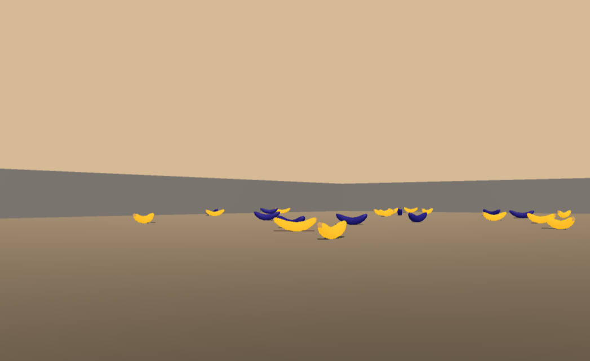
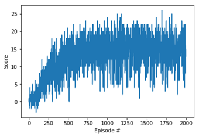

# Deep Q-Learning Agents to solve the Banana-collecting problem

This repo contains implementation of two DQN Agents in __PyTorch__:
-  a __base Agent__, with a Replay Buffer, a seperate target Q-Network, with a 2 hidden layer deep network
- an Agent built on top of the base Agent, which utilizes __Prioritized Replay__.

Agents are tested on the Banana environment packaged and provided by Udacity.


## Environment
---

### Goal & Reward
Collect yellow bananas (+1.0 point), avoid purple bananas (-1.0 point). Interaction is episodic (but could be continous), with a hard step limit of 300.

### Properties of the environment
|                |        | 
| -------------- | ------ |
| _state space_: | __37__ |
| _action space_: | __4__ (forward, backward, left, right) |
| _agents (brains)_: | __1__ |
| _considered solved_: | __> +13__ avg. over 100 episodes |
| _termination criteria_:| __300__ time steps | 
| _reward_:| __+1.0__ when collecting yellow bananas<br />__-1.0__ when collecting a purple banana|


_source of the environment:_ __Udacity - Deep Reinforcement Learning__
_engine_: __unityagents__ `from unityagents import UnityEnvironment`


### Quick setup

1. Download the environment from one of the links below.  You need only select the environment that matches your operating system:
    - Linux: [click here](https://s3-us-west-1.amazonaws.com/udacity-drlnd/P1/Banana/Banana_Linux.zip)
    - Mac OSX: [click here](https://s3-us-west-1.amazonaws.com/udacity-drlnd/P1/Banana/Banana.app.zip)
    - Windows (32-bit): [click here](https://s3-us-west-1.amazonaws.com/udacity-drlnd/P1/Banana/Banana_Windows_x86.zip)
    - Windows (64-bit): [click here](https://s3-us-west-1.amazonaws.com/udacity-drlnd/P1/Banana/Banana_Windows_x86_64.zip)
    
    (_For Windows users_) Check out [this link](https://support.microsoft.com/en-us/help/827218/how-to-determine-whether-a-computer-is-running-a-32-bit-version-or-64) if you need help with determining if your computer is running a 32-bit version or 64-bit version of the Windows operating system.

    (_For AWS_) If you'd like to train the agent on AWS (and have not [enabled a virtual screen](https://github.com/Unity-Technologies/ml-agents/blob/master/docs/Training-on-Amazon-Web-Service.md)), then please use [this link](https://s3-us-west-1.amazonaws.com/udacity-drlnd/P1/Banana/Banana_Linux_NoVis.zip) to obtain the environment.

2. Place the file in the DRLND GitHub repository, in the `p1_navigation/` folder, and unzip (or decompress) the file. 

### Quick start
```python
def create_env(file_name):
        # please do not modify the line below
        env = UnityEnvironment(file_name=file_name)

        # get the default brain
        brain_name = env.brain_names[0]
        brain = env.brains[brain_name]

        # reset the environment
        env_info = env.reset(train_mode=True)[brain_name]

        # number of agents in the environment
        print('Number of agents:', len(env_info.agents))

        # number of actions
        action_size = brain.vector_action_space_size
        print('Number of actions:', action_size)

        # examine the state space 
        state = env_info.vector_observations[0]
        print('States look like:', state)
        state_size = len(state)
        print('States have length:', state_size)
        
        return env, state_size, action_size, brain_name

    env, state_size, action_size, brain_name = create_env("/data/Banana_Linux_NoVis/Banana.x86_64") ## your path here
```


## Agent
---
### Hyperparameters

| Agent                                      | Base DQN Agent      | Prioritized Replay  |
|------------------------------------------------|-------|---|
| GAMMA (discount factor)                        | 0.99  |   |
| TAU (soft update of target network parameter ) | 1e-3  |   |
| Learning Rate                                  | 5e-4  |   |
| Target network is updated every [] episode:    | 4     |   |
| __Epsilon (exploration - exploitation)__          |       |   |
| Epsilon start                                  | 1.0   |   |
| Epsilon min                                    | 0.01  |   |
| Epsilon decay                                  | 0.995 |   |

| Deep Neural Net         | Base DQN Agent     | Prioritized Replay |
|-------------------------|--------------------|--------------------|
| activation function     | ReLU               | ReLU               |
| number of hidden layers | 2                  | 2                  |
| hidden layer 1 size     | 74                 | 74                 |
| hidden layer 2 size     | 74                 | 74                 |
| Loss function           | Mean Squared Error |                    |


| Replay Buffer |          |
|---------------|----------|
| Buffer size   | int(1e5) |
| Sampled Batch size    | 64       |


### Performance

| Training parameters | Base DQN Agent     | Prioritized Replay|
|---------------------|------|-|
| Score window        | 100  | |
| Number of episodes  | 2000 ||
| Episode length      | 300  ||
| Best Score          | 15.4 ||



